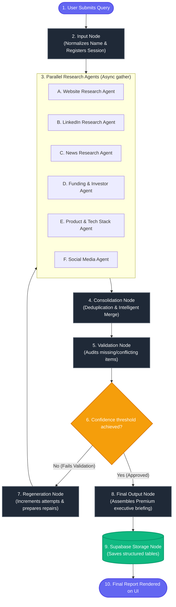

# Company Intelligence Platform — Research Agent Pipeline

An enterprise-grade, stateful multi-agent corporate research orchestration platform built with **LangGraph**, **Python**, **FastAPI**, **Supabase**, and **React**.

---

## 1. High-Level Architecture Diagram

The execution layout of our stateful multi-agent system is detailed in the diagram below:



---

## 2. Dynamic State Schema (`ResearchState`)

Each node in the LangGraph graph manipulates a unified, central state dictionary defined as a typed dictionary:

```python
class ResearchState(TypedDict):
    session_id: str                      # Supabase unique research session UUID
    company_name: str                    # Target corporate name
    industry: Optional[str]              # Targeted industry segment
    custom_query: Optional[str]          # User research focus instructions
    regeneration_attempts: int           # Current validation feedback loop count
    max_attempts: int                    # Maximum feedback loop cap (Default: 3)
    confidence_threshold: float           # Validation pass score threshold (Default: 0.85)
    agent_data: Dict[str, Any]           # Aggregated raw output profiles of the 6 agents
    agent_status: Dict[str, str]         # Real-time state tracker of the 6 agents
    consolidated_profile: Dict[str, Any] # Merged and normalized draft details
    validation_passed: bool              # Validation status outcome flag
    confidence_score: float              # Current validation audit score (0.0 to 1.0)
    failed_fields: List[str]             # List of missing/conflict fields triggering repairs
    validation_history: List[Dict]       # Audit logs trail
    final_report: Optional[Dict]         # Compiled formatted executive brief
    token_usage: Dict[str, int]          # Total budget tokens spent
    errors: List[str]                    # Active exception logs
```

---

## 3. Database Schema Design (Supabase)

The system writes audit trails and reports to Supabase. Execute the schema migration below in your Supabase SQL Editor:

```sql
-- 1. Users Table
CREATE TABLE users (
    id UUID PRIMARY KEY DEFAULT uuid_generate_v4(),
    email VARCHAR(255) UNIQUE NOT NULL,
    created_at TIMESTAMP WITH TIME ZONE DEFAULT TIMEZONE('utc', NOW())
);

-- 2. Research Sessions Table
CREATE TABLE research_sessions (
    id UUID PRIMARY KEY DEFAULT uuid_generate_v4(),
    user_id UUID REFERENCES users(id) ON DELETE SET NULL,
    company_name VARCHAR(255) NOT NULL,
    industry VARCHAR(100),
    custom_query TEXT,
    status VARCHAR(50) DEFAULT 'initiated', -- initiated, researching, consolidating, validating, regenerating, completed, failed
    confidence_score NUMERIC(4,3) DEFAULT 0.000,
    created_at TIMESTAMP WITH TIME ZONE DEFAULT TIMEZONE('utc', NOW()),
    updated_at TIMESTAMP WITH TIME ZONE DEFAULT TIMEZONE('utc', NOW())
);

-- 3. Agent Outputs Table (Intermediate raw profiles)
CREATE TABLE agent_outputs (
    id UUID PRIMARY KEY DEFAULT uuid_generate_v4(),
    session_id UUID NOT NULL REFERENCES research_sessions(id) ON DELETE CASCADE,
    agent_name VARCHAR(50) NOT NULL, -- website, linkedin, news, funding, product, social
    status VARCHAR(50) DEFAULT 'pending', -- pending, running, completed, failed
    raw_json_output JSONB,
    token_usage INT DEFAULT 0,
    created_at TIMESTAMP WITH TIME ZONE DEFAULT TIMEZONE('utc', NOW())
);

-- 4. Validation Logs Table (Audit feedback history)
CREATE TABLE validation_logs (
    id UUID PRIMARY KEY DEFAULT uuid_generate_v4(),
    session_id UUID NOT NULL REFERENCES research_sessions(id) ON DELETE CASCADE,
    attempt_number INT NOT NULL,
    rules_checked JSONB NOT NULL,
    overall_confidence NUMERIC(4,3) NOT NULL,
    failed_fields TEXT[],
    needs_regeneration BOOLEAN DEFAULT FALSE,
    created_at TIMESTAMP WITH TIME ZONE DEFAULT TIMEZONE('utc', NOW())
);

-- 5. Final Reports Table (Unified corporate profile dossiers)
CREATE TABLE final_reports (
    id UUID PRIMARY KEY DEFAULT uuid_generate_v4(),
    session_id UUID NOT NULL UNIQUE REFERENCES research_sessions(id) ON DELETE CASCADE,
    company_name VARCHAR(255) NOT NULL,
    summary TEXT NOT NULL,
    market_analysis JSONB NOT NULL,
    competitor_insights JSONB NOT NULL,
    technology_stack TEXT[] NOT NULL,
    funding_status JSONB NOT NULL,
    risk_opportunity_analysis JSONB NOT NULL,
    token_usage_summary JSONB NOT NULL,
    created_at TIMESTAMP WITH TIME ZONE DEFAULT TIMEZONE('utc', NOW())
);
```

---

## 4. Agent Communication Flow & Lifecycle

1. **User Request Entry**: User inputs a corporate target name (e.g. `Snowflake`), segment, and focus instructions via the React UI.
2. **FastAPI Initialization**: FastAPI validates parameters and creates an entry with status `initiated` inside the Supabase `research_sessions` table, then spins up the background executor thread.
3. **Spelling Normalization (Input Node)**: The name is normalized, and state status updates are broadcast.
4. **Concurrent Gathering (Research Agents Node)**: A concurrent threadpool worker uses `asyncio.gather` to launch all six specialized agents simultaneously:
   - **Website Research Agent**: Extracts mission statements, leadership, headquarters details, and phone numbers.
   - **LinkedIn Research Agent**: Resolves LinkedIn links, employee sizes, executive lists, and recruitment trends.
   - **News Research Agent**: Gathers press releases, major articles, partnerships, and product releases.
   - **Funding/Investor Agent**: Identifies Series funding names, closed capital amounts, dates, and backers.
   - **Product Research Agent**: Pinpoints technical architectures, database backends, software category, and SDK repositories.
   - **Social Sentiment Agent**: Scans sentiment score ratings and developer community gaps or feature requests on social networks.
5. **Intelligent Consolidation (Consolidation Node)**: Aggregates raw outputs and performs deduplication, mapping details cleanly.
6. **Confidence Guard (Validation Node)**: Audits completeness against rules (VAL-CRIT-fields). Deducts weight values for missing keys, and evaluates conflicting CEO/headquarter data.
7. **The Regeneration Loop**:
   - If confidence **fails to satisfy 85%** and attempt limit **is not reached**:
     - The graph triggers `Regeneration Node`, isolates the exact failed keys, and re-triggers only the specific agents mapped to those parameters to research deep repairs.
   - If confidence **passes** OR the loops **reach maximum efforts** (prevents infinite cycles):
     - The graph forwards the state to `Final Output Node`, drafting a premium executive summary, competitive SWOT grids, tech stack badges, and valuation panels.
8. **Permanent Warehousing (Supabase Storage Node)**: Writes final session stats and report documents to database tables, ending execution.

---

## 5. Local Setup Instructions

### Backend (FastAPI + LangGraph)

1. Navigate to the backend directory:
   ```bash
   cd backend
   ```
2. Create and activate a python virtual environment:
   ```bash
   python -m venv venv
   # Windows:
   venv\Scripts\activate
   # macOS/Linux:
   source venv/bin/activate
   ```
3. Install dependencies:
   ```bash
   pip install -r requirements.txt
   ```
4. Copy environment settings and customize keys (OpenAI / Gemini, Supabase URL/Anon):
   ```bash
   cp .env.example .env
   ```
5. Run the server:
   ```bash
   uvicorn app.main:app --host 0.0.0.0 --port 8000 --reload
   ```
   *The Swagger UI API docs will be available at `http://localhost:8000/docs`.*

### Frontend (Vite + React)

1. Navigate to the frontend directory:
   ```bash
   cd ../frontend
   ```
2. Install node dependencies:
   ```bash
   npm install
   ```
3. Run the client development server:
   ```bash
   npm run dev
   ```
   *Open `http://localhost:5173` in your browser to launch the premium dashboard.*

---

## 6. Docker-Compose Orchestration

To run the entire system in a multi-container Docker ecosystem:

1. Place your environmental parameters inside `backend/.env`.
2. Run from the root workspace directory:
   ```bash
   docker-compose up --build
   ```
3. Docker will automatically pull layers, compile the FastAPI API image, compile the static React bundle hosted inside Nginx, and serve:
   - The React Frontend Dashboard on: `http://localhost:5173`
   - The FastAPI REST and Event Stream on: `http://localhost:8000`
