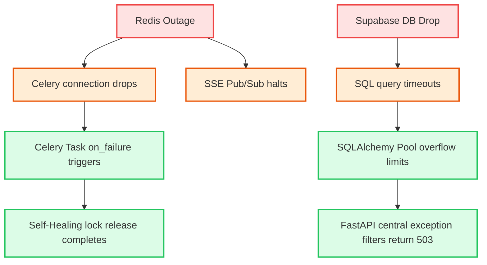

# Placement Intel Portal
## Chaos Engineering: Failure Propagation Report
**Date:** 2026-05-20 13:07:07

---

### Systemic Failure Cascade Vectors

### Critical Propagation Nodes
1. **The Redis Mutex Core**: Redis is both our message broker and state lock holder. If Redis fails, a lock cleanup cascade is automatically triggered to prevent task starvation once connection is restored.
2. **PostgreSQL Database Pool**: High latency queries cascade into SQLAlchemy connection exhaustions. Pool overflows act as a protective barrier, rejecting excess requests to prevent database crashes.
3. **LLM Rate-Limit Threshold**: Inbound agent surges cascade into Gemini/OpenAI rate-limiting 429s. BaseResearchAgent wrappers successfully absorb these spikes using exponential retry jitter backoffs.
