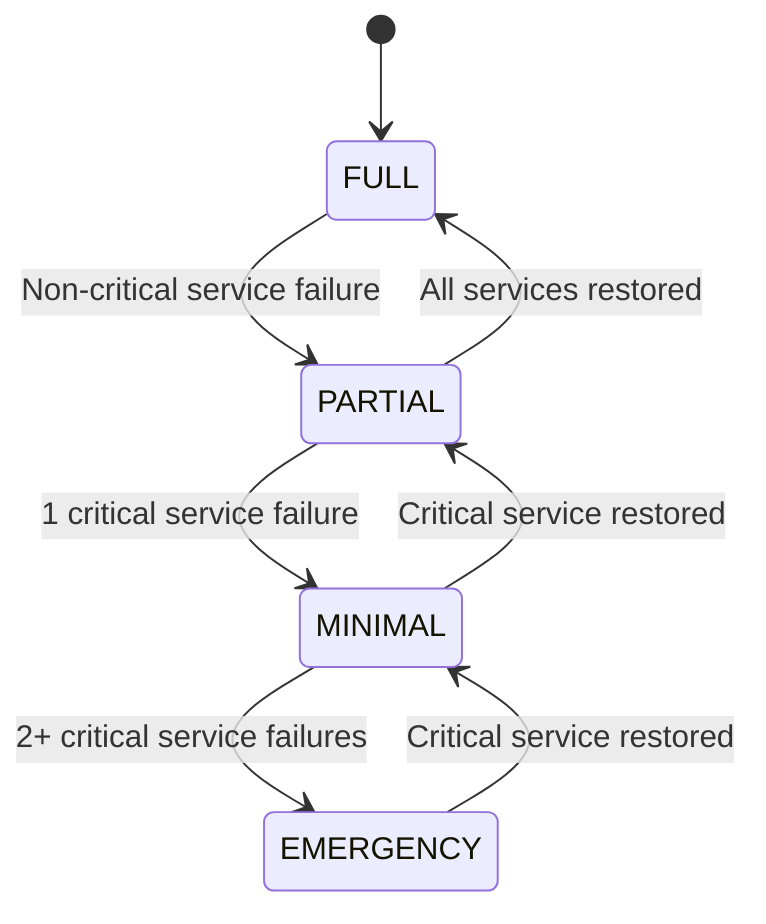

# Graceful Degradation Report
## Service Survivability Engineering Assessment
**Date:** 2026-05-20

---

### Executive Summary
The platform implements a multi-tiered degradation model that allows the system to continue operating at reduced capacity when individual services fail, rather than experiencing total system collapse.

---

### 1. Degradation Level State Machine



### 2. Service Degradation Matrix

| Service | Failure Mode | Degradation Behavior | Fallback |
| :--- | :--- | :--- | :--- |
| **Redis** | Connection lost | FakeRedis in-memory fallback | ✅ MockRedisClient |
| **SMTP** | Connection timeout | Circuit breaker opens, email skipped | ✅ DB + Redis notification |
| **Database** | Pool exhausted | 503 returned, pool overflow limits | ✅ Bounded rejection |
| **Celery Workers** | Worker crash | Task re-queued (acks_late) | ✅ Auto-restart |
| **Celery Beat** | Process killed | Periodic tasks pause | ✅ Supervisor restart |
| **LLM API** | Rate limited (429) | Exponential backoff retry | ✅ Fallback model |
| **Pub/Sub** | Channel lost | Single-instance WebSocket mode | ✅ Direct broadcast |

### 3. ServiceDegradationManager

The `ServiceDegradationManager` singleton tracks active degradations:

```python
degradation_manager.degrade_service("redis", "Connection timeout after 6 retries")
# System level auto-escalates: FULL → MINIMAL

degradation_manager.restore_service("redis")  
# System level auto-de-escalates: MINIMAL → FULL
```

### 4. Fallback Execution Chains

The `FallbackChain` abstraction provides ordered strategy execution:

```python
chain = FallbackChain("notification_delivery")
chain.add_strategy("redis_pubsub", publish_via_redis)
chain.add_strategy("database_persist", save_to_db)
chain.add_strategy("file_log", write_to_file)
result = chain.execute(notification_data)
```

### 5. Critical Path Survivability

| Scenario | Surviving Capabilities |
| :--- | :--- |
| Redis down | API health, DB reads, static content |
| DB down | Health endpoints, cached data from Redis |
| Both Redis + DB down | Health endpoint only (EMERGENCY mode) |
| SMTP down | All except email delivery |
| Workers down | API fully functional, async tasks paused |
