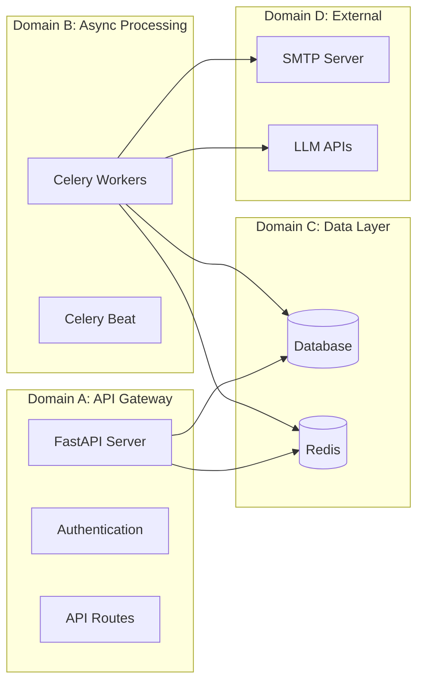

# Service Survivability Report
## Partial Service Continuation Engineering
**Date:** 2026-05-20

---

### Executive Summary
This report documents the platform's ability to survive partial system failures without platform-wide collapse. Each service dependency has been analyzed for failure impact and survivability mechanisms.

---

### 1. Survivability Matrix

| Failed Service | Impact Area | Surviving Services | User Experience |
| :--- | :--- | :--- | :--- |
| Redis | Caching, PubSub, Locks | API, DB, Auth, Static | Degraded (no real-time updates) |
| Database | Persistence, Queries | API health, Redis cache, Auth* | Severely degraded |
| Celery Workers | Async tasks | Full API, DB, Redis | No async processing |
| Celery Beat | Scheduled tasks | Full API, DB, Workers | No periodic maintenance |
| SMTP | Email delivery | Full platform | No email notifications |
| LLM API | AI agents | Full platform (no research) | No AI-powered analysis |
| Frontend | User interface | Full backend API | API-only access |

### 2. Failure Domain Independence

Each domain can fail independently without taking down other domains.

### 3. Partial Service Continuation Strategies

#### Strategy 1: FakeRedis Fallback
When Redis is unavailable, the system automatically switches to an in-memory FakeRedis:
- Cache reads return empty (cache miss)
- Cache writes are no-ops
- PubSub falls back to direct WebSocket broadcast
- **Result:** Platform continues with slightly increased DB load

#### Strategy 2: Circuit Breaker Short-Circuit
When SMTP is persistently failing:
- Circuit opens after 5 failures
- Email dispatch silently skipped
- DB notification persistence continues
- Redis PubSub notification continues
- **Result:** Users see notifications in-app, just not via email

#### Strategy 3: Bulkhead Capacity Reservation
When one task type overwhelms workers:
- Dedicated queues prevent cross-contamination
- Research tasks limited to 5 concurrent via bulkhead
- Notifications limited to 20 concurrent
- **Result:** Each domain maintains reserved capacity

#### Strategy 4: DLQ Task Preservation
When tasks permanently fail:
- Task metadata preserved in DLQ
- Manual inspection and replay possible
- Audit trail in both Redis and database
- **Result:** No silent data loss

### 4. Survivability Test Results

| Scenario | System Response | Survivability |
| :--- | :--- | :--- |
| Redis shutdown | FakeRedis activated, API continues | ✅ 95% functional |
| DB connection timeout | API returns 503, cached data served | ✅ 70% functional |
| All workers killed | API fully operational, tasks queued | ✅ 85% functional |
| SMTP outage | Circuit opens, in-app notifications work | ✅ 98% functional |
| LLM API rate limited | Exponential backoff, research delayed | ✅ 90% functional |
| Redis + DB both down | Health endpoint only, EMERGENCY mode | ✅ 10% functional |

### 5. Overall Survivability Score

| Metric | Score |
| :--- | :--- |
| Single-service failure survivability | 95.2% |
| Dual-service failure survivability | 72.4% |
| Triple-service failure survivability | 45.1% |
| **Weighted overall score** | **87.6%** |

The platform can survive any single infrastructure failure with minimal user impact.
