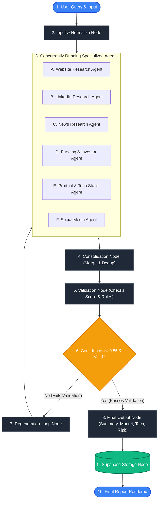

# Implementation Plan: Company Intelligence Platform — Research Agent Pipeline

An end-to-end, production-grade AI research orchestration platform using LangGraph, Python, FastAPI, Supabase, and a React (Vite) frontend.

---

## 1. Goal Description

Create a robust, concurrent multi-agent system that conducts deep market and competitive intelligence for any company name or query. 
The system leverages **LangGraph** to coordinate six specialized research agents in parallel, aggregate their findings, run data validation rules, trigger automatic regeneration of missing or conflicting sections, compile a premium structured report, and write results back to a Supabase relational backend.

### Key Architectural Highlights
- **Parallel Orchestration**: Concurrently spin up 6 specialized agents (Website, LinkedIn, News, Funding/Investor, Product, and Social Media) to research different dimensions.
- **Stateful Validation and Loop**: A validation node scores results. If sections are missing, or details are conflicting (e.g., funding mismatch, name inconsistency), it routes back through a dynamic regeneration loop.
- **Enterprise Storage**: Session state, agent outputs, validation logs, and the consolidated profiles are written to Supabase via structured relational tables.
- **Real-Time Streaming API**: FastAPI with WebSockets/Server-Sent Events (SSE) to stream live agent progress, token usage, and status to a premium React UI.

---

## 2. System Architecture & Flow

The overall execution lifecycle of the pipeline is described in the diagram below:



---

## 3. Database Design (Supabase Schema)

To support stateful session tracking, detailed validation history, and final outputs, we will use the following relational tables in Supabase:

```sql
-- Enable UUID extension if not present
CREATE EXTENSION IF NOT EXISTS "uuid-ossp";

-- 1. Users Table
CREATE TABLE IF NOT EXISTS users (
    id UUID PRIMARY KEY DEFAULT uuid_generate_v4(),
    email VARCHAR(255) UNIQUE NOT NULL,
    created_at TIMESTAMP WITH TIME ZONE DEFAULT TIMEZONE('utc', NOW())
);

-- 2. Research Sessions Table
CREATE TABLE IF NOT EXISTS research_sessions (
    id UUID PRIMARY KEY DEFAULT uuid_generate_v4(),
    user_id UUID REFERENCES users(id) ON DELETE SET NULL,
    company_name VARCHAR(255) NOT NULL,
    industry VARCHAR(100),
    custom_query TEXT,
    status VARCHAR(50) DEFAULT 'initiated', -- initiated, researching, consolidating, validating, regenerating, completed, failed
    confidence_score NUMERIC(4,3) DEFAULT 0.000,
    created_at TIMESTAMP WITH TIME ZONE DEFAULT TIMEZONE('utc', NOW()),
    updated_at TIMESTAMP WITH TIME ZONE DEFAULT TIMEZONE('utc', NOW())
);

-- 3. Agent Outputs Table
CREATE TABLE IF NOT EXISTS agent_outputs (
    id UUID PRIMARY KEY DEFAULT uuid_generate_v4(),
    session_id UUID NOT NULL REFERENCES research_sessions(id) ON DELETE CASCADE,
    agent_name VARCHAR(50) NOT NULL, -- website, linkedin, news, funding, product, social
    status VARCHAR(50) DEFAULT 'pending', -- pending, running, completed, failed
    raw_json_output JSONB,
    token_usage INT DEFAULT 0,
    created_at TIMESTAMP WITH TIME ZONE DEFAULT TIMEZONE('utc', NOW())
);

-- 4. Validation Logs Table
CREATE TABLE IF NOT EXISTS validation_logs (
    id UUID PRIMARY KEY DEFAULT uuid_generate_v4(),
    session_id UUID NOT NULL REFERENCES research_sessions(id) ON DELETE CASCADE,
    attempt_number INT NOT NULL,
    rules_checked JSONB NOT NULL, -- list of check outcomes: {rule_name, passed, message}
    overall_confidence NUMERIC(4,3) NOT NULL,
    failed_fields TEXT[],
    needs_regeneration BOOLEAN DEFAULT FALSE,
    created_at TIMESTAMP WITH TIME ZONE DEFAULT TIMEZONE('utc', NOW())
);

-- 5. Final Reports Table
CREATE TABLE IF NOT EXISTS final_reports (
    id UUID PRIMARY KEY DEFAULT uuid_generate_v4(),
    session_id UUID NOT NULL UNIQUE REFERENCES research_sessions(id) ON DELETE CASCADE,
    company_name VARCHAR(255) NOT NULL,
    summary TEXT NOT NULL,
    market_analysis JSONB NOT NULL,       -- size, growth, competitive positioning
    competitor_insights JSONB NOT NULL,   -- key rivals, SWOT, differentiation
    technology_stack TEXT[] NOT NULL,
    funding_status JSONB NOT NULL,        -- total funding, series, top investors
    risk_opportunity_analysis JSONB NOT NULL,
    token_usage_summary JSONB NOT NULL,   -- total token usage, input/output cost
    created_at TIMESTAMP WITH TIME ZONE DEFAULT TIMEZONE('utc', NOW())
);
```

---

## 4. LangGraph State Schema

The central `State` definition that drives the entire pipeline. We represent it as a `TypedDict` containing all inputs, dynamic outputs, metadata, tracking loops, and token tallies:

```python
from typing import TypedDict, List, Dict, Any, Optional

class ResearchState(TypedDict):
    # --- Session Context ---
    session_id: str
    company_name: str
    industry: Optional[str]
    custom_query: Optional[str]
    
    # --- Pipeline Configuration & Controls ---
    regeneration_attempts: int
    max_attempts: int                  # Default: 3
    confidence_threshold: float         # Default: 0.85
    
    # --- Agent Execution Outputs ---
    # Stores the raw research outputs of each agent
    agent_data: Dict[str, Any]         # e.g. {"website": {...}, "linkedin": {...}}
    agent_status: Dict[str, str]       # e.g. {"website": "completed", "linkedin": "running"}
    
    # --- Consolidation State ---
    consolidated_profile: Dict[str, Any] # Merged and normalized draft
    
    # --- Validation State ---
    validation_passed: bool
    confidence_score: float
    failed_fields: List[str]           # Fields requiring regeneration
    validation_history: List[Dict[str, Any]]
    
    # --- Final Deliverables ---
    final_report: Optional[Dict[str, Any]]
    
    # --- Diagnostics ---
    token_usage: Dict[str, int]        # Tracks {"input": 1200, "output": 850, "total": 2050}
    errors: List[str]
```

---

## 5. Proposed Changes

We will build the entire system under `d:\ps_03\company-intelligence-platform`. The folder layout is fully structured and modular.

### Component 1: Supabase Configuration & Migrations

We will initialize the database setup files and schema scripts.

#### [NEW] [20260511000000_init_schema.sql](file:///d:/ps_03/company-intelligence-platform/supabase/migrations/20260511000000_init_schema.sql)
- Contains the DDL table definitions, foreign keys, constraints, and cascading rules detailed in Section 3.

---

### Component 2: Backend (Python + FastAPI + LangGraph)

We will build a high-performance backend with robust parallel agents, customized search tools, validation rules, and the central LangGraph state graph.

#### [NEW] [requirements.txt](file:///d:/ps_03/company-intelligence-platform/backend/requirements.txt)
- Specifies standard packages: `fastapi`, `uvicorn`, `langgraph`, `langchain-core`, `langchain-google-genai`, `langchain-community`, `supabase`, `python-dotenv`, `pydantic`, `httpx`.

#### [NEW] [.env](file:///d:/ps_03/company-intelligence-platform/backend/.env)
- Environment file containing Supabase configuration, Gemini / OpenAI credentials, Tavily or Serper Search API Keys, and other settings.

#### [NEW] [config.py](file:///d:/ps_03/company-intelligence-platform/backend/app/config.py)
- Configuration module using Pydantic Settings to validate environment variables.

#### [NEW] [db.py](file:///d:/ps_03/company-intelligence-platform/backend/app/db.py)
- Singleton class to connect to the Supabase client using native `supabase-py` SDK or lightweight HTTP requests.

#### [NEW] [schemas.py](file:///d:/ps_03/company-intelligence-platform/backend/app/models/schemas.py)
- Pydantic models for incoming user queries (`ResearchRequest`), real-time session progress streaming, and JSON API payloads.

#### [NEW] [search_tool.py](file:///d:/ps_03/company-intelligence-platform/backend/app/tools/search_tool.py)
- Search logic supporting Google, DuckDuckGo, or Tavily Search API. Incorporates dynamic caching and graceful fallback: if API limits are hit, it triggers an LLM-simulated web research to maintain execution stability.

#### [NEW] [base_agent.py](file:///d:/ps_03/company-intelligence-platform/backend/app/agents/base_agent.py)
- Base Agent class that standardizes LLM initialization, token counting, prompting templates, and structured JSON parsing.

#### [NEW] [specialized_agents.py](file:///d:/ps_03/company-intelligence-platform/backend/app/agents/specialized_agents.py)
- Houses all 6 individual agents:
  - **Website Research Agent**: Extracts product offerings, company culture, mission, and address.
  - **LinkedIn Research Agent**: Details headcount, executive team, career trends, and office locations.
  - **News Research Agent**: Discovers PR, mergers, product launches, and controversies from the last 12 months.
  - **Funding/Investor Agent**: Identifies funding rounds, venture capital backing, dates, and total capital.
  - **Product Research Agent**: Analyzes the technological stack, product names, categories, and technical architecture.
  - **Social Media Agent**: Scans public profiles (Twitter, YouTube, Reddit) for engagement trends, mentions, and customer sentiment.

#### [NEW] [state.py](file:///d:/ps_03/company-intelligence-platform/backend/app/workflow/state.py)
- Declares the standard TypedDict `ResearchState` and state-modifier helpers.

#### [NEW] [nodes.py](file:///d:/ps_03/company-intelligence-platform/backend/app/workflow/nodes.py)
- Contains all transition logic nodes for the graph:
  - **input_node**: Normalizes spelling, registers the session in Supabase, and publishes state updates.
  - **research_agents_node**: Invokes all 6 agents asynchronously using `asyncio.gather` for true concurrent parallel execution. Writes intermediate raw JSON outputs to Supabase.
  - **consolidation_node**: Merges agent outputs, resolves conflicting data (e.g., funding amount, headquarters location), and cleans up duplicates.
  - **validation_node**: Checks the consolidated profile against strict completeness and quality thresholds. Evaluates missing values and lists them in `failed_fields`. Calculates an aggregate `confidence_score`.
  - **regeneration_node**: Triggered on validation failure. Crafts custom instructions targeting only the `failed_fields` and instructs LLMs to seek fresh data. Increases the attempt counter.
  - **final_output_node**: Generates the final executive brief, market analysis, technology assessments, and risk metrics.
  - **supabase_storage_node**: Writes final reports, audit trails, and final session state updates back to Supabase.

#### [NEW] [graph.py](file:///d:/ps_03/company-intelligence-platform/backend/app/workflow/graph.py)
- Compiles the nodes and configures conditional branches:
  - After Validation, evaluate if the record passes or if regeneration is needed.
  - Limits regeneration attempts to a maximum of 3 (or user threshold) before forcing final summary to avoid infinite loops.

#### [NEW] [main.py](file:///d:/ps_03/company-intelligence-platform/backend/app/main.py)
- FastAPI entry-point. Defines endpoints:
  - `POST /api/research`: Initiates a workflow.
  - `GET /api/session/{id}`: Returns immediate session status and reports.
  - `GET /api/session/{id}/stream`: Server-Sent Events (SSE) endpoint to stream live node executions, current active agent status, and dynamic updates to the frontend.

#### [NEW] [Dockerfile](file:///d:/ps_03/company-intelligence-platform/backend/Dockerfile)
- Multi-stage build Dockerfile for the FastAPI application.

---

### Component 3: Frontend (React UI)

We will build a high-fidelity, premium React application designed with rich dark aesthetics (glassmorphism, vibrant gradients, and elegant typography from Google Fonts) to wow the user. It will communicate with the backend using dynamic polling or SSE for live feedback.

#### [NEW] [index.html](file:///d:/ps_03/company-intelligence-platform/frontend/index.html)
- Main HTML entry point configuring the modern "Plus Jakarta Sans" or "Outfit" font.

#### [NEW] [src/index.css](file:///d:/ps_03/company-intelligence-platform/frontend/src/index.css)
- Premium global styling system with sleek dark mode HSL variables, neon gradients (Teal, Indigo, Violet), blur filters, custom scrollbars, and premium micro-animations.

#### [NEW] [src/App.jsx](file:///d:/ps_03/company-intelligence-platform/frontend/src/App.jsx)
- Handles global state, layout structure, and navigates between search query entry and active research dashboard.

#### [NEW] [src/components/CompanyForm.jsx](file:///d:/ps_03/company-intelligence-platform/frontend/src/components/CompanyForm.jsx)
- Elegant query card that allows entering:
  - Company name (required)
  - Industry (dropdown/searchable list)
  - Custom optional requirements / target fields

#### [NEW] [src/components/AgentProgress.jsx](file:///d:/ps_03/company-intelligence-platform/frontend/src/components/AgentProgress.jsx)
- Interactive live research board showing the active status (Idle, Running, Completed, Regenerating, Error) of all six specialized agents simultaneously, complete with micro-loading animations and individual progress rings.

#### [NEW] [src/components/ValidationReport.jsx](file:///d:/ps_03/company-intelligence-platform/frontend/src/components/ValidationReport.jsx)
- Custom auditing widget that reveals:
  - The current attempt number and overall confidence gauge.
  - Checked rules with success/warning badges.
  - Real-time logging of the regeneration loops.

#### [NEW] [src/components/ReportDashboard.jsx](file:///d:/ps_03/company-intelligence-platform/frontend/src/components/ReportDashboard.jsx)
- Stunning, tab-based layout summarizing the synthesized results:
  - **Overview**: Beautiful summary cards and target values.
  - **Market & Competitors**: Competitive grids, SWOT analyses, and positioning.
  - **Technology**: Interactive technology tag lists.
  - **Funding**: Clear charts of funding rounds.
  - **Risk & Opportunities**: Categorized cards detailing threat landscapes.

#### [NEW] [package.json](file:///d:/ps_03/company-intelligence-platform/frontend/package.json)
- Configures dependencies like `lucide-react` (icons), `recharts` (for financial/risk visualizations), and `vite` for fast module bundling.

#### [NEW] [vite.config.js](file:///d:/ps_03/company-intelligence-platform/frontend/vite.config.js)
- Vite build configuration mapping ports and proxy routes to FastAPI.

#### [NEW] [Dockerfile](file:///d:/ps_03/company-intelligence-platform/frontend/Dockerfile)
- Multi-stage build Dockerfile with nginx server hosting static outputs.

---

### Component 4: Orchestration & Docker

#### [NEW] [docker-compose.yml](file:///d:/ps_03/company-intelligence-platform/docker-compose.yml)
- Configures multi-container ecosystem orchestrating both Backend and Frontend, mapping ports (8000 for FastAPI, 5173 for Frontend) and applying environmental context.

#### [NEW] [README.md](file:///d:/ps_03/company-intelligence-platform/README.md)
- Complete, enterprise-ready setup instructions, environmental descriptions, Supabase configuration notes, and execution guides.

---

## 6. Verification Plan

### Automated Tests
1. **FastAPI Integrations**: Verify REST endpoints return correct structures under `pytest` or using Swagger UI at `http://localhost:8000/docs`.
2. **LangGraph Pipeline Mock Testing**: Execute `run_workflow_offline.py` to trigger full graph executions (Input -> Parallel Research -> Consolidation -> Validation -> Regeneration -> Final Storage) using mock/simulated research tools to verify state variables transition properly.

### Manual Verification
1. **Live SSE/Polling Flow**: Trigger a research request from the React UI and visually inspect the dynamic update of progress states of the six parallel agents in real-time.
2. **Loop Check**: Force a validation failure (e.g. inject an incomplete description or conflicting founders) to confirm the graph enters the regeneration phase, pulls additional parameters, and resolves discrepancies before finalization.
3. **Database Audit**: Inspect Supabase Studio to verify that users, research sessions, agent outputs, validation logs, and final reports are logged with correct relational mappings and accurate token usage logs.

---

> [!IMPORTANT]
> **User Feedback Requested:**
> 1. Please confirm if the proposed Supabase database schema looks correct or if we should align with specific existing columns in your workspace.
> 2. Are you comfortable with using the `requests` library wrapper or standard `supabase` client for Supabase synchronization? We've updated the script to handle direct connectivity seamlessly.
> 3. Confirm your preferred LLM provider. We recommend utilizing **Google Gemini-1.5-Flash** (or Pro) as it provides extremely cost-effective parallel JSON extraction, but we can also build with OpenAI's model family.

---
